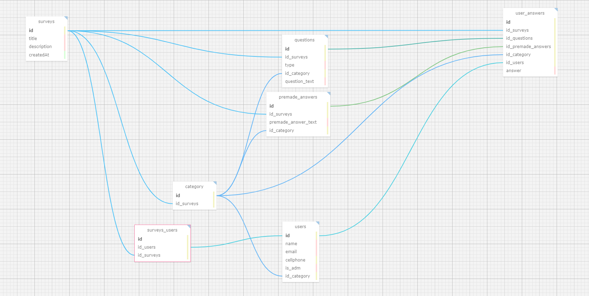

## Documentação Simplificada do Modelo Relacional

**Projeto:** Abandono Zero

**Data:** 2024-05-09

**Autor:** Lucas Matheus Nunes

**Objetivo:** Descrever o modelo relacional do projeto de forma resumida e simplificada.

## Entidades

- **Pesquisas** (`surveys`): Armazena informações básicas sobre as pesquisas (título, descrição, etc.); O parceiro sugeriu durante o kick-off a criação posterior de formulários, desse modo, deve existir a possibilidade de criar novas pesquisas.
- **Usuários** (`users`): Armazena informações básicas sobre os usuários (nome, email, se é Administrador, etc.).
- **Categoria** (`category`): Define qual é a categoria do usuário, dentro dos subgrupos definidos pelo parceiro no kick-off(Passado: Já teve cão, Presente: Tem cão, Futuro: Quer ter cão, Null: Não quer ter cão).
- **Questões** (`questions`): Armazena todas as questões disponíveis em todos os quatro questionários (a seleção/a filtragem pode ser feita por id_category)
- **Respostas pré-definidas** (`premade_answers`): Armazena as respostas pré-definidas (como, por exemplo, em perguntas do tipo "caixas de seleção" ou "check-box").
- **Respostas dos usuários** (`user_answers`): Armazena as respostas fornecidas pelos usuários (a seleção/a filtragem pode ser feita por id_category)
- **Pesquisas e Usuários** (`surveys_users`): Armazena o id de uma pesquisa e o id de um usuário. A entidade surgiu de um relacionamento N:N entre as entidades (`surveys`) e (`users`).

## Relacionamentos

- Uma **pesquisa** pode ter várias **perguntas**, porém, uma pergunta pertence a somente uma pesquisa, em nosso projeto **(1:N)**; 
- Uma **pesquisa** pode ter várias **categorias** (isto é, meios de agrupar os dados em conjuntos), porém, uma categoria pertence a somente uma pesquisa **(1:N)**; 
- Uma **pesquisa** pode ter várias **respostas pré-definidas**, porém, uma resposta pré-definida somente pertencer a uma pesquisa **(1:N)**;
- Uma **pesquisa** pode ter várias **respostas de usuário**, porém, uma resposta de usuário somente pode referir a uma pergunta **(1:N)**;
- Um **usuário** pode responder diversas **pesquisas** e uma **pesquisa** pode ser respondida por diversos **usuários** **(N:N)**;
    - **Note que o relacionamento entre `surveys` e `users` é N:N, mas na prática esse relacionamento foi transformado em uma nova entidade `surveys_users`, a qual se relaciona de forma (1:N) com cada uma individualmente**;
   

- Uma **categoria** pode ter várias **perguntas**, porém, uma pergunta somente pertence a uma categoria **(1:N)**;
- Uma **categoria** pode ter várias **respostas pré-definidas**, porém, uma resposta pré-definida somente pertence a uma categoria **(1:N)**;
- Uma **categoria** pode ter vários **usuários**, porém, um usuário somente pertence a uma categoria **(1:N)**;
- Uma **categoria** pode ter várias **respostas de usuários**, porém, uma resposta de usuário somente pertence a uma categoria **(1:N)**;
   

- Uma **questão** pode ter várias **respostas de usuário**, porém, uma resposta de usuário somente pertence a uma questão **(1:N)**
- Uma **resposta pré-definida** pode ter várias **respostas de usuário**, porém, uma resposta de usuário somente pertence a uma resposta pré-definida **(1:N)**
- Um **usuário** pode ter várias **respostas de usuário**, porém, uma resposta de usuário somente pertence a um usuário **(1:N)**
 

## Regras de Negócio

- Todos os campos obrigatórios devem ser preenchidos.
- Um usuário pode responder a um questionário somente uma vez.
- As informações devem ser consistentes entre os formulários.
- Cada pergunta somente pode pertencer a uma pesquisa (nesse projeto, em específico, não é possível reaproveitar perguntas em diferentes pesquisas).
- Os administradores não podem editar formulários (adicionando informações novas ou deletando campos, por exemplo), contudo...
- É possível criar novos formulários, conforme o desejado.
- Os usuários não podem editar informações já salvas, exceto em casos específicos.
- As informações dos usuários são confidenciais.

## Diagrama

Figura 1 - Modelagem do Banco de Dados

Fonte: Material produzido pelo autor(2024).

## Considerações Finais

Este modelo relacional simplificado fornece uma base para o gerenciamento eficiente das informações dos usuários e suas respostas nos formulários do projeto Abandono Zero. As entidades, seus atributos e relacionamentos garantem a organização e a integridade dos dados. As regras de negócio garantem a consistência e a confiabilidade das informações.